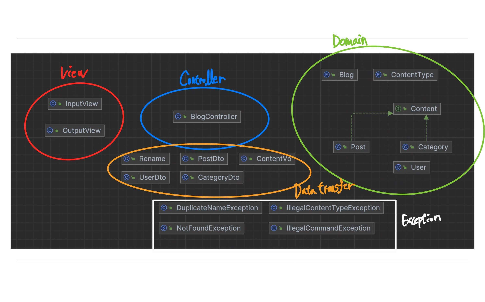
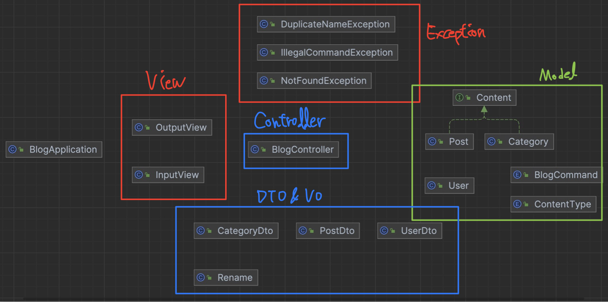
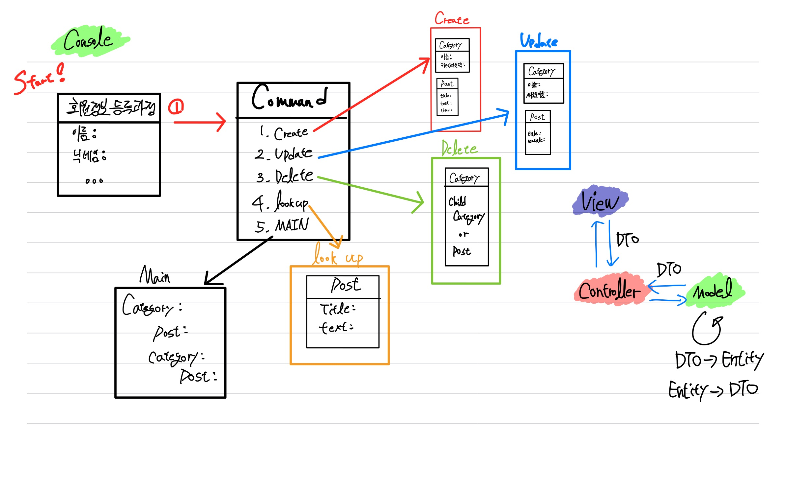
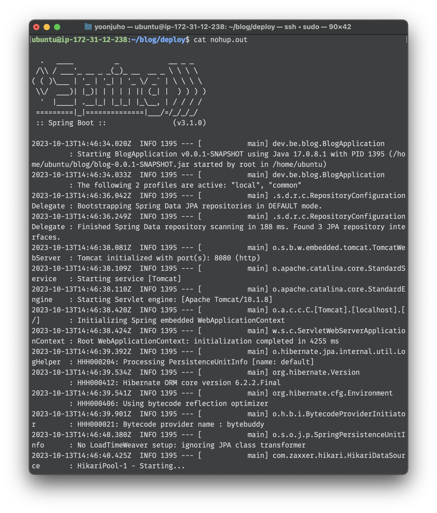
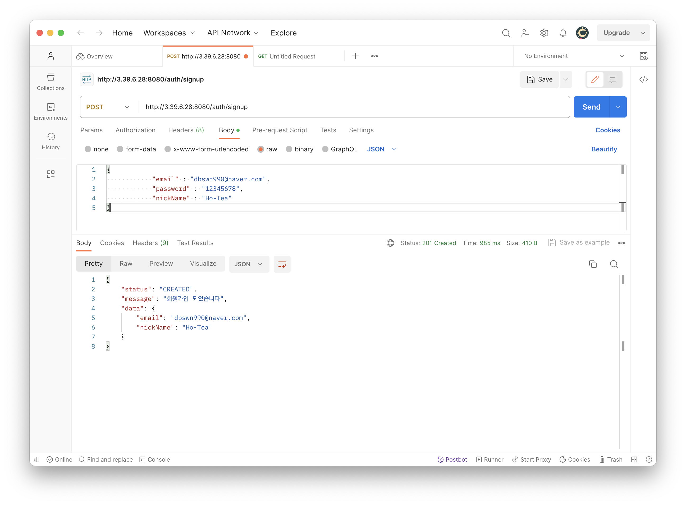

# Blog
기획부터 배포, 운영까지 진행하는 블로그 프로젝트

## 모든 과정은 [Notion](https://www.notion.so/Blog-project-112866e72a574afb8f62757337094284?pvs=4)에 기록

## Level 1
  > 수정 전
  

  > 수정 후
  

  > Logic
  

## Level 2
  > Console
  

  > API
  